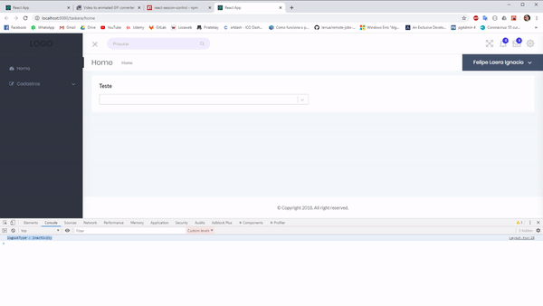
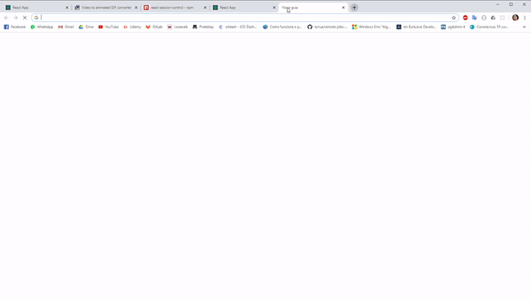

  

# React Session Control

React Session Control is a component to provide session control to your application. It can help you to manage the inactivity time and token existence.





## Getting started

### Prerequisites

  

Your application must have both bootstrap(^4.0.0) and jquery(^3.0.0).

  

### Installing

  

```

npm install --save react-session-control

```

  

### Using

To use you only need to import and put on your app. The only thing to check is if the component is in an area where the application is already authenticated.


```js
import { SessionControl, LogoutTypes } from  'react-session-control';

//Should render after authentication.
export function Layout(){

	function handleSessionControlLogout(logoutType){
		//Do yout logout logic here...
	}

	return ( 
		<>
		<SessionControl
			inactivityTimeout={900}
			modalInactivityTimeout={30}
			storageTokenKey="token"
			onLogout={handleSessionControlLogout}
		/>
		//your code... 
		</>	
	)
}
```
  
### Props

#### inactivityTimeout
Inictivity timeout in seconds. **Required**
#### modalInactivityTimeout  
Inictivity timeout when modal is open in seconds. **Required**
#### onLogout
Callback to be called when user ends his inactivity time limit, click in logout button or lose his token.  **Required**
#### storageToken 
Key do check existence in local storage. If you dont pass this config the component will not check storage.
**default**: ```undefined```
#### title
Title to display in modal header.
**default**: ```'Inactivity alert'```
#### message
Message to display in modal header.
**default**: ```'You have been inactive for a long time. Do you want to remain logged in?'```
#### timerMessage
Message to display before time count in modal.
**default**: ```'You will be disconnected in: '```
#### continueButtonText
Text to display in continue button.
**default**: ```'Continue'```
#### logoutButtonText
Text to display in logout button.
**default**: ```'Logout'```
#### showDocumentTitleAlert
If should display document title alert.
**default**: ```true```
#### documentTitleAlertText
The text displayed as document title case showDocumentTitleAlert is true.
**default**: ```'INACTIVITY ALERT'```

## Authors

  

*  **Felipe Laera** - *Software Engineer*

  

See also the list of [contributors](https://github.com/LaeraFelipe/react-session-control/contributors) who participated in this project.

## License

  

This project is licensed under the MIT License - see the [LICENSE.md](https://github.com/LaeraFelipe/react-session-control/blob/master/LICENSE.md) file for details