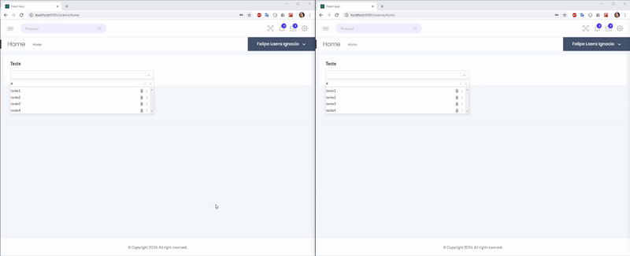

  

# React Session Control

React Session Control is a lib to provide session control to your application. It can help you to manage the inactivity time and token existence.

## Features

### Inactivity time
Using the component AuthenticatedSessionControl you can set the maximum time for the user stay inactive and use a callback to do some action after this time. The inactivity time is calculated using all tabs.

<p align="center">
	
</p>

### Sync tabs
Using the component AuthenticatedSessionControl and UnauthenticatedSessionControl you can syncronize authentication status between tabs. When one tab disconects or conects the other one follows the action.

<p align="center">
	
</p>

If the inactivity modal is open on one or more tabs and if one of them is activated, only it will continue with the modal.

<p align="center">
	
</p>

## Getting started

### Prerequisites

Just install and use!

### Installing

```
npm install --save react-session-control

```

### Using

Basicaly the lib provide two componentes: 

#### UnauthenticatedSessionControl
Component to put in your unauthenticated area in your app to warn you when token is set by other tabs.

```js
import { UnauthenticatedSessionControl } from  'react-session-control';

//Should render after authentication.
export function Login(){
	function handleSessionControlLogin(logoutType){
		//Do your logic here...
	
	}
	return ( 
		<>
		<UnauthenticatedSessionControl
			storageTokenKey="token"
			onLogin={handleSessionControlLogin}
		/>
		//your code... 
		</>	
	)
}
```
##### Props

#### storageToken 
Key do check existence in local storage. If you dont pass this config the component will not check storage. **Required**

#### tokenChangeDebounceTime
The time in miliseconds to debounce token changes.
**default**: 500

#### AuthenticatedSessionControl
Component to put in a authenticated area in your app to warn you when the inacitivity time is over, the user click in logout inside modal or if the token has been removed by other tabs.

```js
import { AuthenticatedSessionControl, LogoutTypes } from  'react-session-control';

//Should render after authentication.
export function Layout(){

	function handleSessionControlLogout(logoutType){
		//Do yout logout logic here...
	}

	return ( 
		<>
		<AuthenticatedSessionControl
			inactivityTimeout={900}
			modalInactivityTimeout={30}
			storageTokenKey="token"
			onLogout={handleSessionControlLogout}
		/>
		//your code... 
		</>	
	)
}
```
  
##### Props

#### inactivityTimeout
Inictivity timeout in seconds. **Required**
#### modalInactivityTimeout  
Inictivity timeout when modal is open in seconds. **Required**
#### onLogout
Callback to be called when user ends his inactivity time limit, click in logout button or lose his token.  **Required**
#### storageToken 
Key do check existence in local storage. If you dont pass this config the component will not check storage.
**default**: ```undefined```
#### title
Title to display in modal header.
**default**: ```'Inactivity alert'```
#### message
Message to display in modal header.
**default**: ```'You have been inactive for a long time. Do you want to remain logged in?'```
#### timerMessage
Message to display before time count in modal.
**default**: ```'You will be disconnected in: '```
#### continueButtonText
Text to display in continue button.
**default**: ```'Continue'```
#### logoutButtonText
Text to display in logout button.
**default**: ```'Logout'```
#### showDocumentTitleAlert
If should display document title alert.
**default**: ```true```
#### documentTitleAlertText
The text displayed as document title case showDocumentTitleAlert is true.
**default**: ```'INACTIVITY ALERT'```
#### tokenChangeDebounceTime
The time in miliseconds to debounce token changes.
**default**: 500
#### userActivityThrottleTime
The time in miliseconds to throttle user activity.
**default**: 500
#### debug
If the component is in debug mode.
**default**: false
#### onInactivityTimeout
Callback to be called when inactivy ends.
#### onInactivityModalTimeout
Callback to be called when modal inactivy ends.
#### renderModal
Modal element to render.

## Authors

*  **Felipe Laera** - *Software Engineer*  

See also the list of [contributors](https://github.com/LaeraFelipe/react-session-control/contributors) who participated in this project.

## License

This project is licensed under the MIT License - see the [LICENSE.md](https://github.com/LaeraFelipe/react-session-control/blob/master/LICENSE.md) file for details